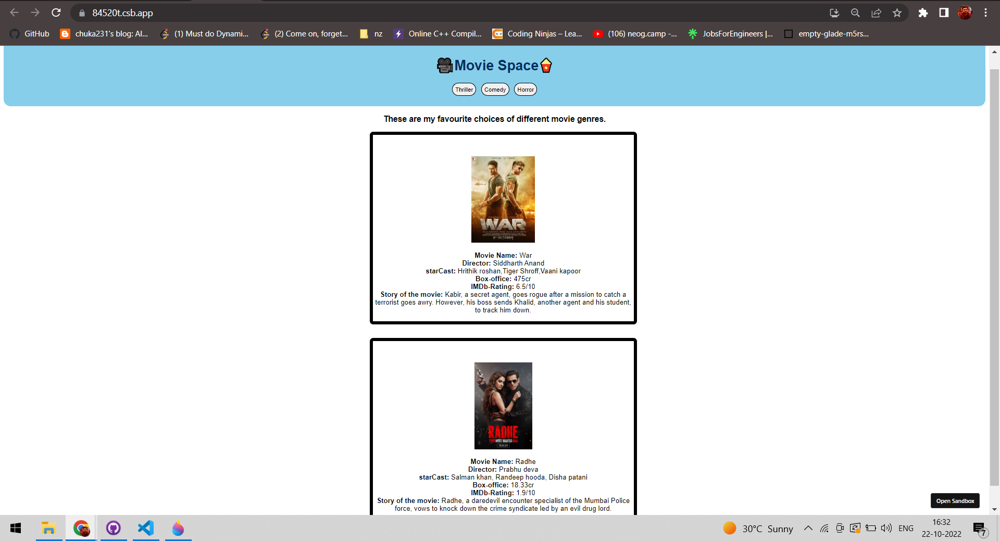

# MovieSpace
## About: 
1. The application shows movie details on the basis of preferences selected.
2. Users are provided with 3 genres of movies.
3. Data is created and imported from data.js file separately.
4. Created with CodeSandbox
5. Live link is [here](https://84520t.csb.app/).

## Tech stack used:
1. HTML
2. CSS
3. React

